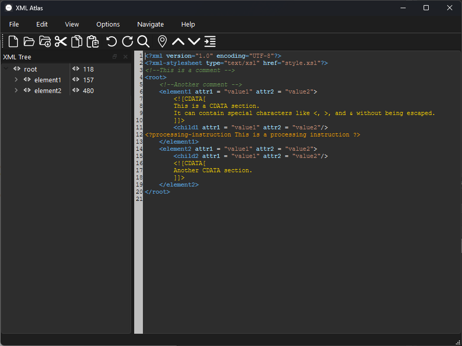

# xml-atlas
XML viewer editor project


[]()
[](https://github.com/glaure/xml-atlas/actions/workflows/app_xml_atlas_ci.yml)

Open Source XML Editor that is heavily inspired by XML Marker (http://symbolclick.com/).


# Features

* XML tree view
* Syntax highlighting
* Dark and light theme


# Screenshots

## XML Atlas light theme


## XML Atlas dark theme



# Qt

Please install a valid Qt version.
The current reference version is Qt 6.8.1

## Windows deployment

Debug:

```
%PATH_TO_QT%/msvc2022_64/bin/windeployqt.exe --no-quick-import --no-system-d3d-compiler build/Debug/
```

Release

```
%PATH_TO_QT%/msvc2022_64/bin/windeployqt.exe --no-quick-import --no-system-d3d-compiler build/Release
```

